# 내일은 투자왕(모의주식사이트)
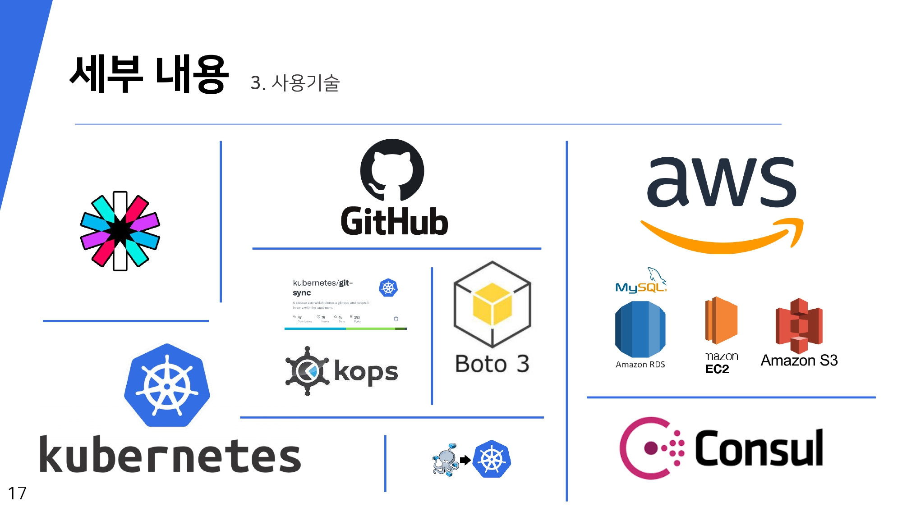

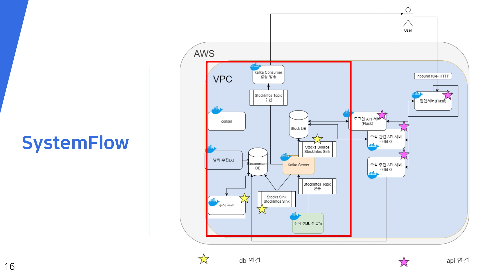

## 쿠버네티스 설치

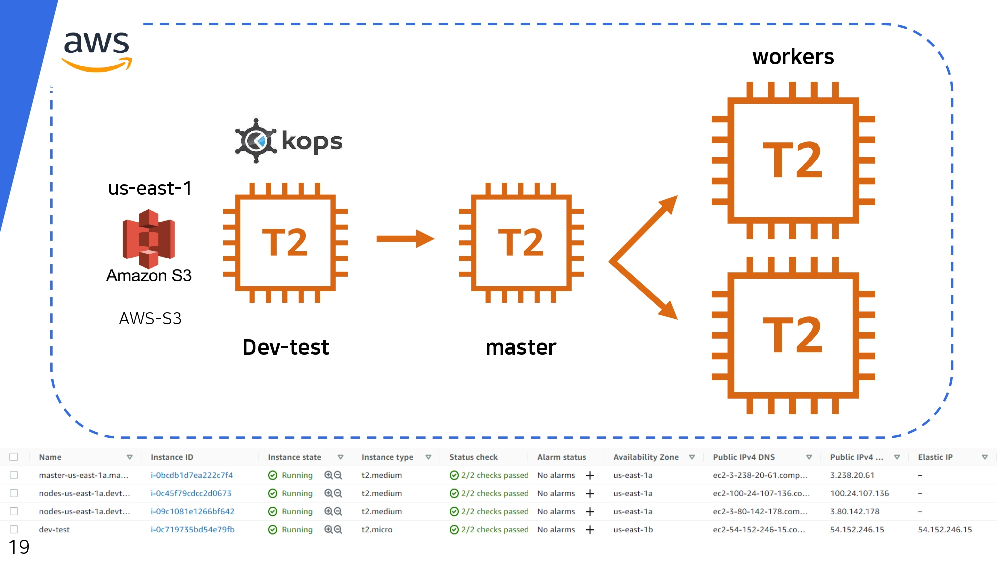

- 각 노드들에 쿠버네티스 설치를 위해서 KOPS를 이용하였습니다.

- kops란 쿠버네티스 생성 및 관리를 쉽게 하도록 도와주는 오픈소스 툴로서, 프로덕션 레벨의 쿠버네티스 클러스터를 간단한 CLI 명령을 통해 생성, 관리, 업그레이드, 삭제할 수 있도록 지원합니다.

- Kops를 통해 클러스터를 구성하기 위해서는 클러스터의 정보를 저장할 S3도 함께 만들어주어야하는데 aws S3 api 를 이용하여 us-east-1 리전에 버킷을 생성해주었습니다.

## DB 연동

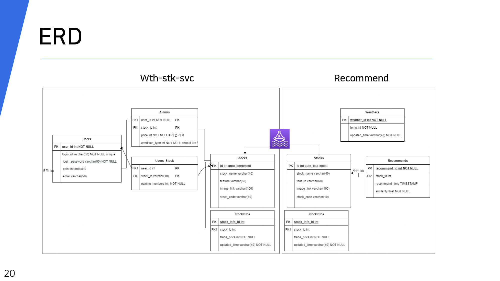

- 데이터베이스는 AWS의 RDS서비스를 이용하여서 구축하였습니다. RDS는 Mysql을 설치하였고 MSA적 특성을 살리기 위해 두개의 데이터베이스를 구축하였습니다. 

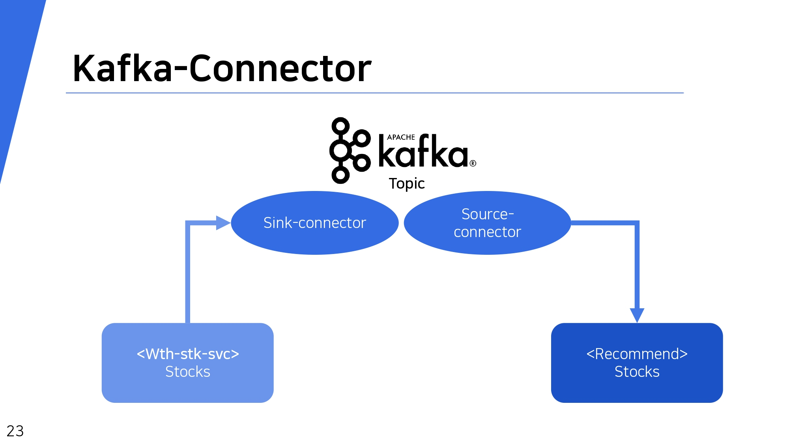

- 두개의 데이터베이스는 주식 시세정보가 담긴 StockInfos 테이블과 종목정보가 담긴 Stocks테이블을 가지고 있습니다. 이 두 테이블은 같은 내용을 가져야하므로 이를 동기화 시켜줄 필요가 있는데 이를 위해서 카프카의 메시지 큐잉서비스를 사용했습니다.

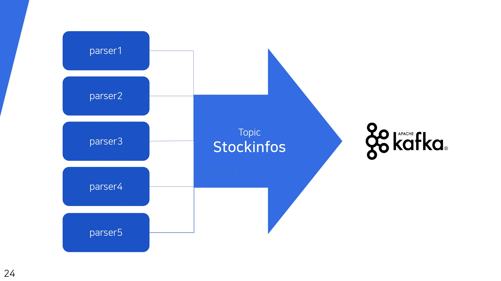

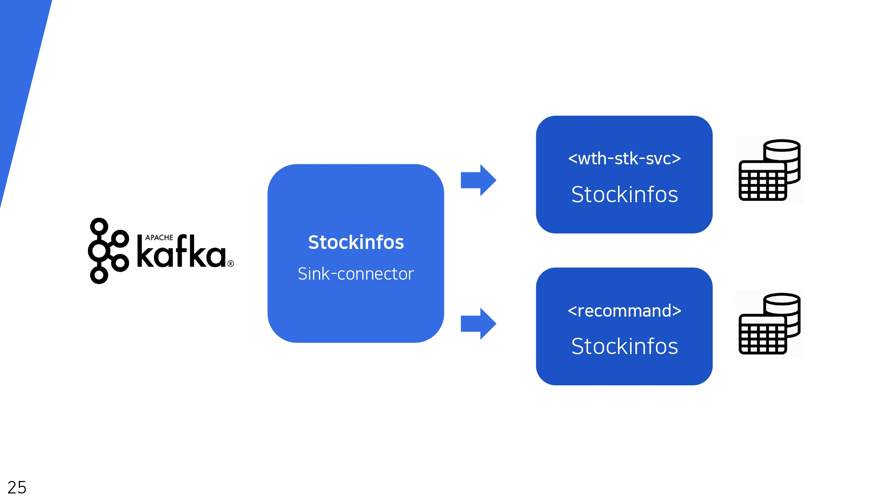

- 주식정보 파싱 서비스는 총 5개의 파드로 구성하였는데 각 파드별로 하나의 종목의 시세정보를 파싱해옵니다. 그리고 카프카 프로듀서를 생성해서 카프카 토픽에 스키마 정보를 전달하면 싱크커넥터를 통해 데이터베이스로 데이터가 저장됩니다.

- 이러한 과정을 통해 INSERT문을 반복 사용해서 데이터베이스에 삽입하는 것보다 빠른 정보 저장이 가능해졌습니다.

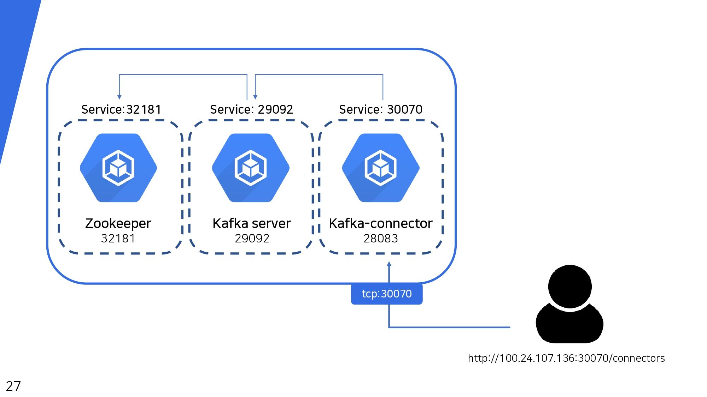

- 카프카를 이용해서 데이터베이스 동기화를 위해서는 주키퍼서버와 카프카서버, 그리고 카프카 커넥터 서버가 필요합니다. 
- 이 서버들은 각각 파드로 생성되기 때문에 파드간에 통신을 위해서 서비스를 생성해주어야 합니다. 
- 주키퍼 서버는 32181번 포트로 서비스를 생성해서 카프카 서버에서 접근할 수 있게 포트를 열어주었습니다.
- 카프카서버는 29092번 포트로 카프카 서버에 접근할 수 있도록 서비스를 생성해주었습니다. 
- 카프카 커넥터는 28083번 포트로 서비스를 생성해주어서 카프카 커넥터 파드가 생성된 노드의 퍼블릭 아이피에 28083번 포트로 접근하면 카프카 커넥터 서비스를 이용할 수 있습니다.

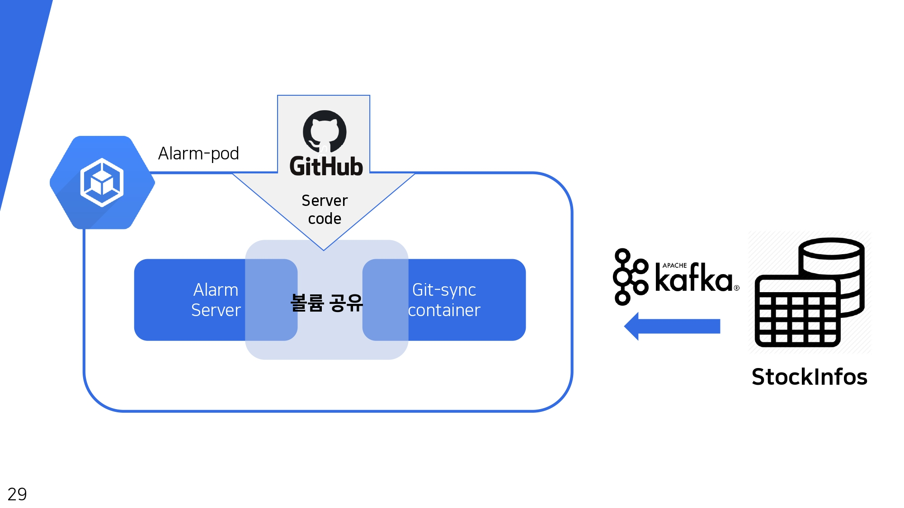

- Git-sync를 이용해서 github의 리포지토리에 저장된 데이터를 볼륨으로 생성하고 파드에서 볼륨마운트 해서 사용할 수 있습니다. 이렇게 하면 코드는 깃에 저장되어있기 때문에 재배포 없이 코드를 수정할 수 있습니다. 

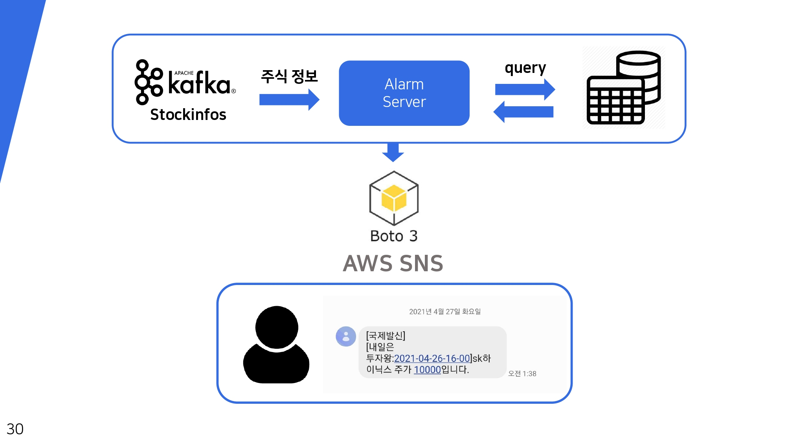

- AWS SNS 서비스를 이용해서 카프카 토픽에 특정 기준을 만족하는 주식정보가 들어오면 사용자에게 메시지가 전송됩니다. 

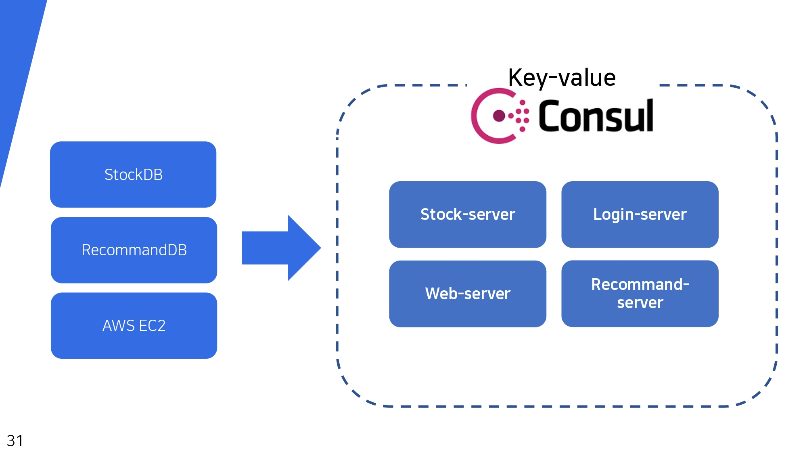

- Consul KV 주요 용도는 구성 매개 변수와 메타 데이터를 저장하는 것입니다. DB에 접근하거나 jwt토큰생성에 필요한 config정보를 kv로 컨설서버에 저장해서 config정보가 하드코딩 되지 않도록 했고, 또한 주식종목같이 서비스 도중 변경할 가능성이 있는 정보도 kv에 저장하여 서비스도중에 kv정보만 변경해주면 재배포하지 않아도 서비스를 변경할 수 있도록 했습니다.

- 컨설을 통해 각 서비스들이 안정적으로 접근할 수 있도록 고정된 아이피를 가지도록 하기위해 클러스터 바깥에 위치하도록 구성하였습니다. 

